# Mini Project Introduction to GitOps and ArgoCD

## Introduction to GitOps and ArgoCD using AWS

### Project Overview

This project is focused on introducing learners to GitOps using ArgoCD, specifically tailored for a Kubernetes environment hosted on AWS (Amazon Web Services). The project encompasses understanding GitOps principles, installing ArgoCD on an AWS-Managed Kubernetes cluster, and exploring ArgoCD's architecture and components.


## Introduction to the GitOps and ArgoCD Project

Welcome to this exciting journey where you will immerse yourself in the world of GitOps using ArgoCD, particularly within an AWS-hosted Kubernetes environment. This project is designed to equip you with the essential skills and knowledge to implement modern DevOps practices. By understanding and applying the principles of GitOps and leveraging the capabilities of ArgoCD, you'll be stepping into an era of more efficient, reliable, and scalable cloud-native application management. This course is meticulously structured to guide you through each concept, tool, and practice, ensuring you gain a holistic understanding of GitOps in the context of Kubernetes.


### Why is this relevant?

Imagine you're that conductor of an orchestra, where each musician represents a component of a Kubernetes cluster. Just as a conductor ensures harmony and synchrony among the different musicians, GitOps using ArgoCD harmonizes and synchronizes your Kubernetes deployments. In this analogy, the musical score is your Git repository, holding the 'desired state' of your applications. ArgoCD acts like your baton, interpreting the score and guiding the orchestra (Your Kubernetes cluster) to perform as intended, adjusting in real-time to maintain the symphony (or desired state).


This project is not just about learning the technicalities, It's about understanding how to orchestrate your Kubernetes environment efficiently and elegantly. As cloud-native technologies become increasingly prevalent, the ability to manage and deploy applications using GitOps principles is becoming a crucial skill in the tech industry. This course will help you understand these principles from the ground up and apply them in real-world scenario, making you a maestro of Kubernetes orchestration using ArgoCD.


### Pre-requisites

1. Basic understanding of Kubernetes

    - Familiarities with Kubernetes concepts such as Pods, deployments, and Services.

    - Resources: [Kubernetes Basics](https://kubernetes.io/docs/tutorials/kubernetes-basics/).


2.   AWS Account

     - An active AWS account to create and manage an Amazon EKS cluster.

     - Sign Up: [AWS Account Creation](https://repost.aws/knowledge-center/create-and-activate-aws-account)

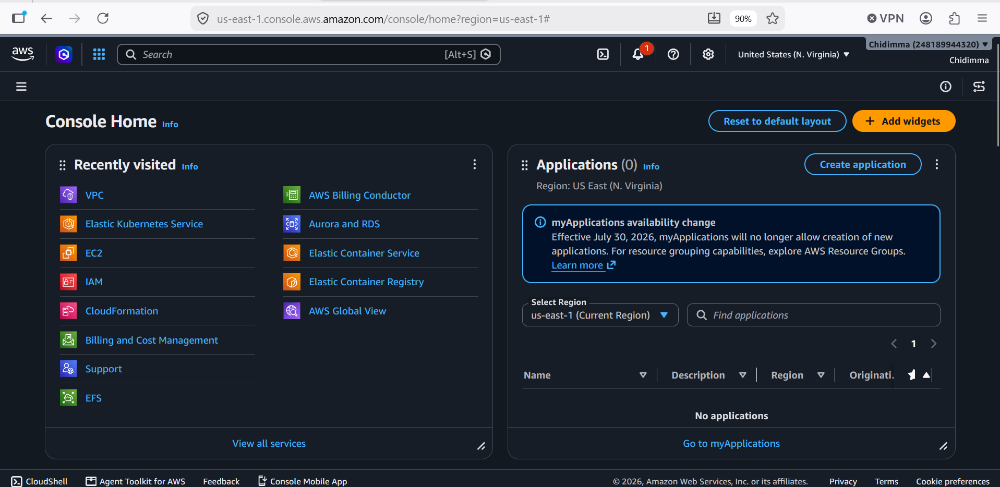

3.   Amazon EKS Cluster

    - A running EKS (Elastic Kubernetes Service) Cluster.

    - Installation Guide [Creating an Amazon EKS Cluster](https://docs.aws.amazon.com/eks/latest/userguide/create-cluster.html)

    - Tools: AWS Management Console or AWS CLI for cluster management.

Below are the command for creating Amazon EKS cluster.

```
eksctl create cluster \
--name kustomize-cluster \
--region us-east-1 \
--nodegroup-name worker-nodes \
--node-type t3.medium \
--nodes 2 \
--managed
```

4. Kubectl

    - Command-Line tool for interacting with the Kubernetes cluster.

    - Installation Guide: [Install and Set Up kubectl](https://kubernetes.io/docs/tasks/tools/)

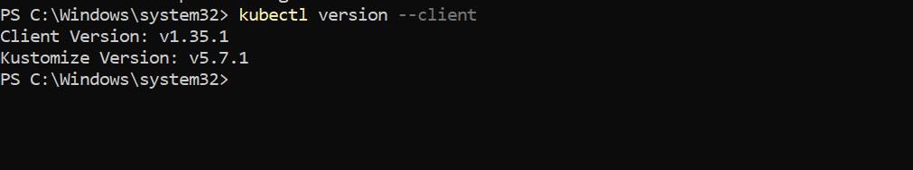

5.  AWS CLI

    - Command-line tool for managing AWS services.

    - Installation Guide: [Installing AWS CLI](https://aws.amazon.com/cli/)
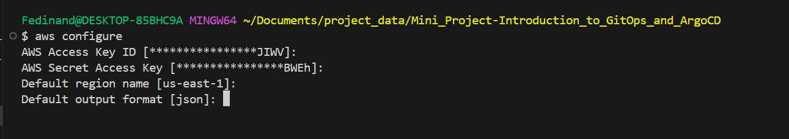

6. Git

    - Version control system to manage source code.

    - Installing Guide: [Git Installing](https://git-scm.com/book/en/v2/Getting-Started-Installing-Git)

    - Familiarity with basic Git operations like clone, commit, push, and merge.


7. ArgoCD

    - Understanding of ArgoCD's basic concepts and its role in GitOps.

    - ArgoCD Documentation: [ArgoCD-GitOps for Kubernetes](https://argo-cd.readthedocs.io/en/stable/)


8.  Text Editor/IDE

    - A text editor or Integrated Development Environment (IDE) for editing code and configuration files.

    - Options include Visual Studio Code (VSCode), Sublime Text, Atom, etc.

    - VSCode: [Download Visual Studio Code](https://code.visualstudio.com/download)


9.  Docker (Optional but Recommended).

    - For building and managing containers, if the project includes working with containerized applications

    - Installation Guide: [Docker Installation](https://docs.docker.com/get-started/get-docker/).


10. Helm and Kustomize (Optional)

    - Tools for managing Kubernetes packages and customizing Kubernetes object configurations

    - Helm Installation: [Installing Helm](https://helm.sh/docs/intro/install/)

    - Kustomize Installation: [Installing Kustomize](https://kubectl.docs.kubernetes.io/installation/kustomize/)

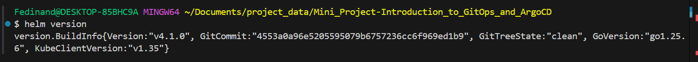

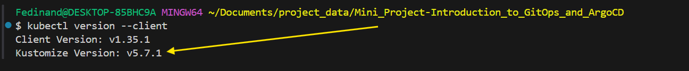


11. Internet Connection

    - Stable internet connection for accessing AWS Service, online documentation, and forums.


12. Hardware Requirements

    - A computer with sufficient RAM (at least 8GB recommended) and processing power to handle virtualization if necessary.


## Lesson 1.1 GitOps Principles and the Role of ArgoCD

Objective: Understand GitOps principles and ArgoCD's role in Kubernetes.

## Lesson 1.1: GitOps Principles and the Role of ArgoCD

### Objective

To gain a comprehensive understanding of GitOps principles and the pivotal role of ArgoCD in implementing these principles within a Kubernetes environment.

1. Study GitOps Principles:

    ### Key Concepts: Explore the fundamental concept of GitOps including:

      - **Infrastructure as Code (IaC):** Understand how infrastructure is managed and provisioned through code, rather than manual processes.

      - **Automated Deployment:** Learn about the automated process that ensure deployments are consistent and repeatable.

      - **Merge Requests for Change Management:** Discover how changes are reviewed and merged, ensuring a controlled and traceable approach to environment modifications.


- Benefits of GitOps:

    - **Enhanced Developer Productivity:** Due to automated, predictable deployments.

    - **Improved Stability:** As the entire system state is version-controlled.

    - **Easier Recovery:** The ability to revert to a previous state is simplified.


**Recommended Reading:** For a deeper dive, explore the [Weaveworks GitOps Principles](https://ambking1234.biz/?action=register&marketingRef=6788b227da9499f55f6ea745). This resources provided an in-depth look at the principles, and benefits of GitOps.


2. Role of ArgoCD in GitOps:

    - **Automating Kubernetes Deployments:**

        - Understanding how ArgoCD automates the deployment of applications to Kubernetes clusters by monitoring Git repositories.

        - ArgoCD continuously compares the desire application state in Git with the live state in Kubernetes, ensuring consistency.


- **Features of ArgoCD:**

    - **Declarative Setup:** ArgoCD uses a declarative approach for infrastructure and application deployment.

    - **Self-healing:** Automatic correction of detected drifts in the desired and live states.

    - **Multi-Cluster Management:** Manage deployments across multiple Kubernetes clusters.

    - **Integrating with Various Tools:** Works with Helm, Kustomize, and others for configuration management.


- Use Cases:

    - Illustrate common scenarios where ArgoCD provides significant advantages, such as multi-environment deployments and rollbacks.


- **ArgoCD Documentation:** Review the [ArgoCD-GitOps for Kubernetes](https://argo-cd.readthedocs.io/en/stable/) for detailed insights into its functionalities, installation, and usage.


Lesson 1.2: Installing and Configuring ArgoCD in an AWS Kubernetes Environment.

**Objective:** Install ArgoCD on an EKS (Elastic Kubernetes Service) cluster on AWS.

### Steps:

1. Set Up an EKS Cluster:

    - Use AWS Management Console or AWS CLI to create an EKS Cluster.

    - Follow the AWS Guide: [Creating an Amazon EKS Cluster](https://docs.aws.amazon.com/eks/latest/userguide/create-cluster.html)

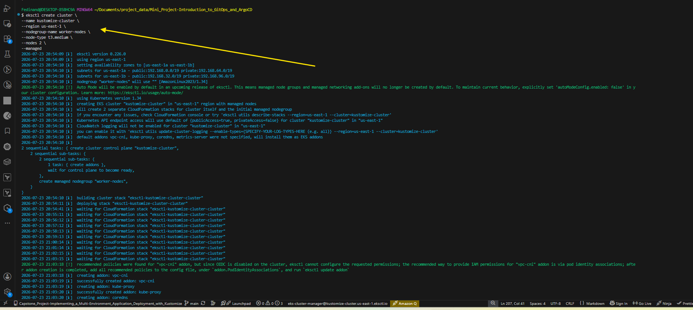

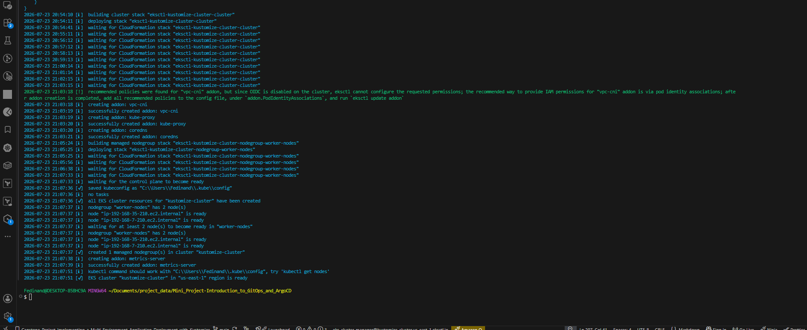


2. Install ArgoCD on EKS:

    - Apply the ArgoCD installation manifest using kubectl.

    - Code Snippet:

```
kubectl create namespace argocd
kubectl apply -n argocd -f https://raw.githubusercontent.com/argoproj/argo-cd/stable/manifests/install.yaml
```

   - Explanation: This code snippet creates a namespace for ArgoCD and then applies the ArgoCD manifest to the EKS cluster

I run the command above but error was encountered which is showing in the image below.

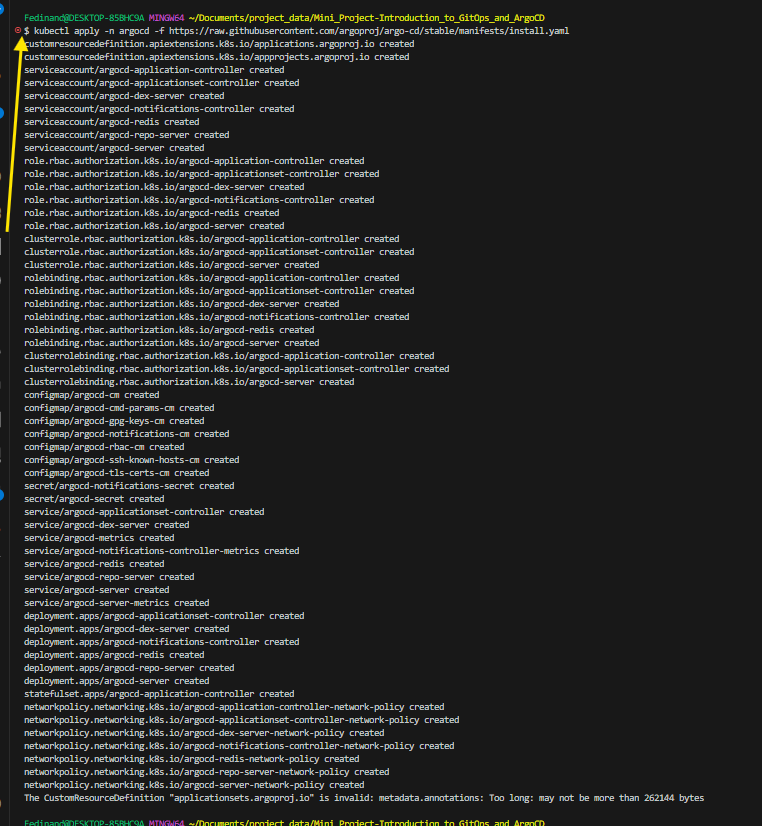


Once you have this kind of challenge in the image above then use server-side apply:

```
kubectl apply --server-side \
 -n argocd /
 -f https://raw.githubusercontent.com/argocdproj/argo-cd/stable/manifests/install.yaml
 ```


3. Access ArgoCD UI on EKS:

    - Use kubectl port- forwarding or set up an Ingress controller to access the ArgoCD UI.

    - Code Snippet for Port Forwarding:

```
kubectl port-forward svc/argocd-server -n argocd 8080:443
```

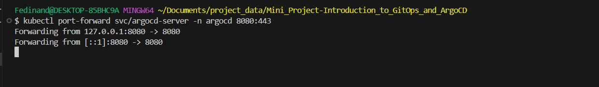


-  Explanation: This forwards port 8080 of your local machine to port 443 of the ArgoCD server, allowing access via `localhost:8080` in your chrome browser or any.

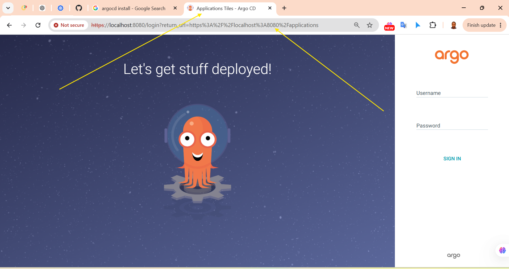

Then get the initial admin password by typing the command below.

```
kubectl -n argocd get secret argocd-initial-admin-secret \
-o jsonpath="{.data.password}" | base64 --decode
```

The Image below shows the access into the ArgoCD's platform.

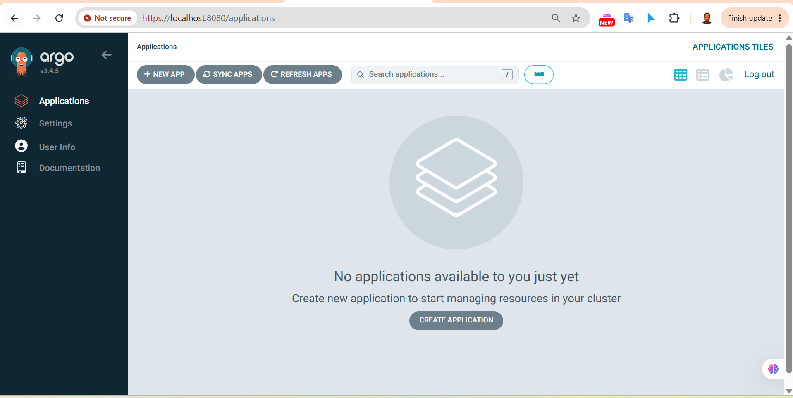


### Lesson 1.3: ArgoCD Architecture: Understanding Core Components

**Objective:** Get acquainted with ArgoCD's architecture in the context of AWS.

### Steps:

1. **Explore ArgoCD Components:**

    - Understand the functions of the API Server, Repository Server, and Application Controller.


2. **Navigate ArgoCD UI:**

    - Familiarize yourself with viewing applications, managing repositories, and monitoring deployments through the ArgoCD UI.


3. **Deploy a Sample Application:**

    - Use a Public Git repository with Kubernetes manifests to deploy an application via ArgoCD.

    - Follow the ArgoCD guide: [Deploying Applications](https://argo-cd.readthedocs.io/en/stable/user-guide/deploying-applications/)

I have to clone the public git repository for this project   `https://github.com/argoproj/argocd-example-apps`


4. **Monitor Synchronization:**

    - Observer how ArgoCD syncs the desired state from the Git repository to the EKS Cluster.


## Additional Resources

   - AWS EKS Documentation: [Amazon EKS User Guide](https://docs.aws.amazon.com/eks/latest/userguide/what-is-eks.html)

   - ArgoCD User Guide: [ArgoCD User Guide](https://argo-cd.readthedocs.io/en/stable/user-guide/)

   - GitOps Workflow Tutorial: [A Practical Guide to GitOps](https://ambking1234.biz/?action=register&marketingRef=6788b227da9499f55f6ea745)
     


    